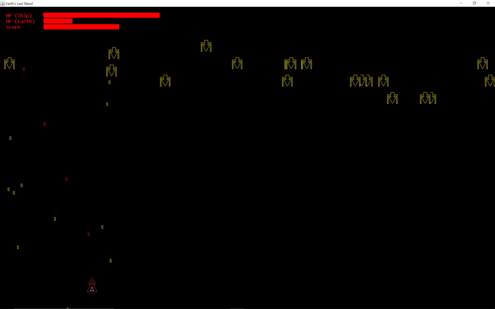

# Earth's Last Stand

It's the Last Stand of Earth, and you are the only pilot who showed up. Your starship is the last line of defense against a relentless invasion; the enemy stops at nothing in its linear path towards victory. You lose when Earth loses - if you get destroyed, you will watch the invasion until Earth falls.
